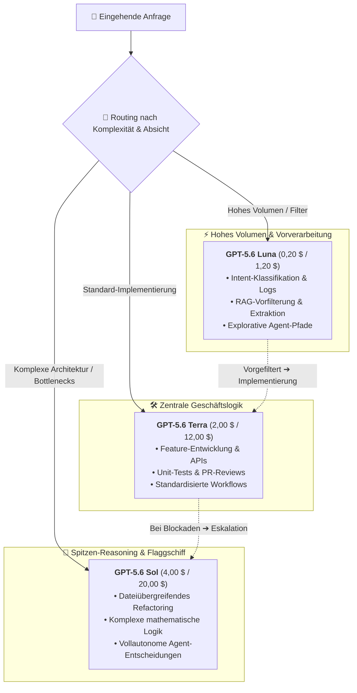

Am 22. August 2026 kündigte OpenAI offiziell eine befristete Preissenkung für sein Flaggschiff-Modell **GPT-5.6 Sol** (sowie den Kurznamen-Alias `gpt-5.6`) an. Diese Reduzierung gilt für mindestens drei Monate (vom 22. August bis zum 21. November 2026) und umfasst sowohl API-Aufrufe als auch die Verrechnung von Guthabenkontingenten.

Nach den überraschenden Preissenkungen Ende Juli für die Einstiegs- und Mittelklassemodelle GPT-5.6 Luna (-80 %) und GPT-5.6 Terra (-20 %) schlägt OpenAI nun direkt an der Leistungsspitze des Portfolios zu.

## Die Preisänderungen im Detail

Laut der aktuellen offiziellen OpenAI-Preisliste wurden die API-Tarife für `gpt-5.6-sol` und `gpt-5.6` wie folgt angepasst:

| Token-Typ | Bisheriger API-Preis (pro 1M) | Neuer API-Preis (pro 1M) | Änderung |
| :--- | :--- | :--- | ---: |
| **Standard-Input** | 5,00 $ | **4,00 $** | **-20,0 %** |
| **Standard-Output** | 30,00 $ | **20,00 $** | **-33,3 %** |
| **Cache-Schreibzugriff (Write)** | 6,25 $ | **5,00 $** | **-20,0 %** |
| **Cache-Treffer (Read)** | 0,50 $ | **0,40 $** | **-20,0 %** |

Hinweise:

- Die befristete Preissenkung gilt für mindestens 3 Monate; OpenAI wird die Infrastrukturauslastung vor einer dauerhaften Festlegung evaluieren.
- Der Rabatt gilt automatisch für die API sowie für Kontingente in ChatGPT Work / Codex.
- Prompt Caching gewährt weiterhin 90 % Rabatt (10 % des Input-Preises), Cache-Writes werden mit 1,25× Input berechnet.

Damit ist das Preissystem der gesamten GPT-5.6-Familie neu ausgerichtet:

| Modellstufe | Kernpositionierung | Neuer Input-Preis ($/1M) | Neuer Output-Preis ($/1M) |
| :--- | :--- | :--- | :--- |
| **GPT-5.6 Luna** | Maximale Kosteneffizienz / Vorverarbeitung / Tägliche Agenten | 0,20 $ | 1,20 $ |
| **GPT-5.6 Terra** | Ausgewogenes Arbeitspferd / Feature-Entwicklung / Alltagsaufgaben | 2,00 $ | 12,00 $ |
| **GPT-5.6 Sol** | Spitzen-Flaggschiff / Systemarchitektur / Tiefes Reasoning | **4,00 $** | **20,00 $** |

## Tiefenanalyse: Warum senkt OpenAI die Preise für Sol?

Beim ursprünglichen Start von GPT-5.6 wurde Sol mit 5,00 $ / 30,00 $ bepreist, was in der Entwickler-Community zu Zurückhaltung bezüglich des Preis-Leistungs-Verhältnisses führte. Warum weicht OpenAI so schnell von der Tradition ab, Flaggschiff-Preise stabil hochzuhalten?

### 1. 33,3 % Rabatt auf den Output: Lösung für den Kernengpass bei Agenten und Reasoning

In einfachen Chat-Szenarien dominieren meist Input-Tokens. Mit der Verbreitung von **autonomen KI-Agenten, dateiübergreifender Code-Generierung und Extended Reasoning** explodiert das Output-Volumen jedoch förmlich.

Ein komplexer Refactoring-Lauf erzeugt rasch Zehntausende Output-Tokens in Denkketten und Quelltexten. Der bisherige Preis von 30 $/1M war eine massive Hürde. Die Senkung auf **20 $/1M** (-33,3 %) reduziert die Gesamtkosten intensiver Agenten-Pipelines um 25 % bis über 30 %.

### 2. Strategischer Gegenschlag gegen Open-Source und Marktbegleiter

In den letzten Monaten haben Open-Source-Modelle (wie DeepSeek, Qwen u. a.) bei Coding und mathematischem Schließen stark aufgeholt und Marktanteile durch minimale Inferenzkosten gewonnen.

Bleiben proprietäre Spitzenmodelle zu teuer, greifen Entwickler zu Open-Source-Alternativen. Durch die Verbilligung von Sol baut OpenAI **einen uneinholbaren Preis-Leistungs-Burggraben an der Leistungsspitze** auf und bindet anspruchsvolle Entwicklerteams.

### 3. Die Taktik hinter dem 3-Monats-Fenster

Die zeitliche Befristung verfolgt zwei Ziele:
- **Infrastruktur-Stresstest**: Günstigere Preise führen zu einem Ansturm auf Sol, wodurch OpenAI die Skalierbarkeit seiner Rechenzentren unter realen Lastbedingungen erproben kann.
- **Bindung von Unternehmensbudgets**: Rechtzeitig zu den Budgetplanungen für das zweite Halbjahr setzt OpenAI einen starken Anreiz zur dauerhaften Migration kritischer Workloads.

## Praxisleitfaden: Mehrebenen-Routing mit der GPT-5.6-Familie

Mit einem deutlich erschwinglicheren Sol-Modell bildet die Familie GPT-5.6 eine herausragende Routing-Architektur:

In Kombination mit dem **nativen 1M-Kontextfenster** und **Prompt Caching** lassen sich die Gesamtkosten pro Aufgabe (Cost-per-Task) auf ein neues Rekordtief senken.

## Ab sofort auf MuiRouter verfügbar

MuiRouter hat die Tarife in Echtzeit auf die neuen OpenAI-Preise umgestellt:

- Anfragen an `gpt-5.6-sol` und `gpt-5.6` werden ab sofort mit **4,00 $ (Input) / 20,00 $ (Output)** abgerechnet;
- Prompt-Caching-Rabatte greifen vollautomatisch;
- Keine Code- oder Konfigurationsänderungen erforderlich.

Besuche den [Playground](/playground) und teste die Vorzüge von GPT-5.6 Sol noch heute zu den neuen Spitzenkonditionen!
