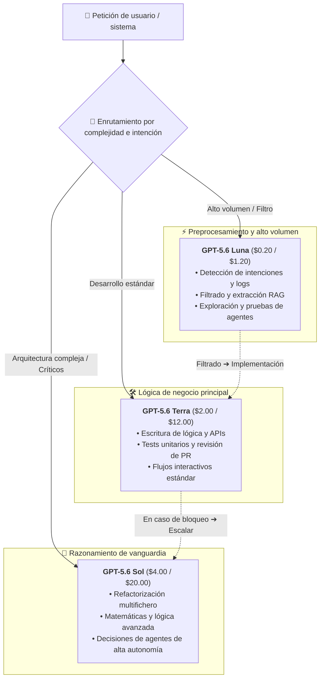

El 22 de agosto de 2026, OpenAI anunció oficialmente una reducción promocional de precios para su modelo insignia, **GPT-5.6 Sol** (y su alias corto `gpt-5.6`). Esta rebaja estará vigente durante al menos 3 meses (del 22 de agosto al 21 de noviembre de 2026), abarcando tanto las llamadas a la API como el consumo de créditos asociados.

Tras la sorpresiva rebaja de finales de julio en los modelos de gama baja y media GPT-5.6 Luna (-80 %) y GPT-5.6 Terra (-20 %), este nuevo movimiento sacude nuevamente el panorama de precios de la IA, apuntando esta vez a la cúspide de la línea.

## Resumen de ajustes de precios

Según la tarifa oficial de OpenAI, los precios de la API para `gpt-5.6-sol` y `gpt-5.6` se han actualizado de la siguiente manera:

| Tipo de token | Precio API anterior (por 1M tokens) | Precio API nuevo (por 1M tokens) | Variación |
| :--- | :--- | :--- | ---: |
| **Entrada estándar (Input)** | $5.00 | **$4.00** | **-20.0%** |
| **Salida estándar (Output)** | $30.00 | **$20.00** | **-33.3%** |
| **Escritura en caché (Cache Write)** | $6.25 | **$5.00** | **-20.0%** |
| **Entrada en caché (Cached Input)** | $0.50 | **$0.40** | **-20.0%** |

Notas:

- Esta rebaja promocional está garantizada por al menos 3 meses; OpenAI evaluará el rendimiento de la infraestructura antes de decidir su continuidad definitiva.
- El descuento aplica automáticamente a la API y a las cuotas de facturación de ChatGPT Work / Codex.
- El Prompt Caching mantiene su 90 % de descuento (10 % del precio de entrada) y la escritura en caché se factura a 1.25× la entrada estándar.

Con este cambio, la escala de precios de toda la familia GPT-5.6 queda reestructurada:

| Nivel de modelo | Posicionamiento clave | Nueva tarifa entrada ($/1M) | Nueva tarifa salida ($/1M) |
| :--- | :--- | :--- | :--- |
| **GPT-5.6 Luna** | Máxima rentabilidad / Preprocesamiento / Agentes diarios | $0.20 | $1.20 |
| **GPT-5.6 Terra** | Modelo equilibrado / Desarrollo de funciones / Tareas generales | $2.00 | $12.00 |
| **GPT-5.6 Sol** | Insignia de vanguardia / Arquitectura de sistemas / Razonamiento profundo | **$4.00** | **$20.00** |

## Análisis profundo: ¿Por qué OpenAI reduce el precio de Sol?

En el lanzamiento original de GPT-5.6, Sol se mantuvo en un elevado $5.00 / $30.00, lo que generó dudas en la comunidad de desarrolladores sobre su relación coste-beneficio. ¿Por qué OpenAI rompe tan pronto su costumbre de sostener precios altos en sus modelos insignia?

### 1. Rebaja del 33.3 % en la salida: Solucionando el punto crítico de agentes y razonamiento

En conversaciones sencillas, los tokens de entrada suelen predominar. Sin embargo, con el auge de **Agentes de IA autónomos, generación de código entre múltiples archivos y razonamiento extendido (Extended Reasoning)**, el volumen de salida se ha multiplicado exponencialmente.

Una sola tarea de refactorización o depuración avanzada puede generar decenas de miles de tokens de salida. El coste previo de $30/1M representaba una barrera económica sustancial. Bajar la salida directamente a **$20/1M** (-33.3 %) reduce la factura de flujos agénticos intensivos entre un 25 % y un 30 % o más.

### 2. Contraataque estratégico frente al código abierto y la competencia

En los últimos meses, los modelos de código abierto (liderados por DeepSeek, Qwen y otros) han avanzado a pasos agigantados en programación y matemáticas, ganando cuota de mercado gracias a costes de inferencia mínimos.

Si los modelos punteros siguen siendo inaccesibles, los desarrolladores terminan recurriendo a alternativas abiertas. Al abaratar Sol, OpenAI **construye una sólida barrera competitiva en la cima del rendimiento**, fidelizando proyectos y canales de desarrollo de alto valor.

### 3. La lógica detrás del periodo de 3 meses

Plantear la rebaja como una ventana temporal responde a dos objetivos claros:
- **Prueba de estrés de infraestructura**: El abaratamiento disparará las peticiones a Sol, permitiendo evaluar la capacidad de escalado de los clústeres.
- **Captura de presupuestos corporativos**: Coincidiendo con las planificaciones del segundo semestre, esta rebaja incentiva la migración definitiva de cargas de trabajo críticas.

## Guía práctica: Enrutamiento multinivel con la familia GPT-5.6

Con Sol mucho más accesible, la familia GPT-5.6 conforma una arquitectura de enrutamiento sumamente eficiente:

Combinando este enrutamiento con la **ventana de contexto nativa de 1M** y el **Prompt Caching**, los equipos pueden minimizar el coste por tarea (Cost-per-Task) a niveles inéditos.

## Disponible de inmediato en MuiRouter

MuiRouter ha actualizado sus tarifas en tiempo real con los precios oficiales de OpenAI:

- Las peticiones a `gpt-5.6-sol` y `gpt-5.6` se facturan con el nuevo precio de **$4.00 (entrada) / $20.00 (salida)**;
- Los descuentos de Prompt Caching se aplican automáticamente;
- No es necesario realizar cambios de código ni de configuración.

¡Visita el [Playground](/playground) y descubre hoy mismo la potencia de GPT-5.6 Sol a un precio inmejorable!
