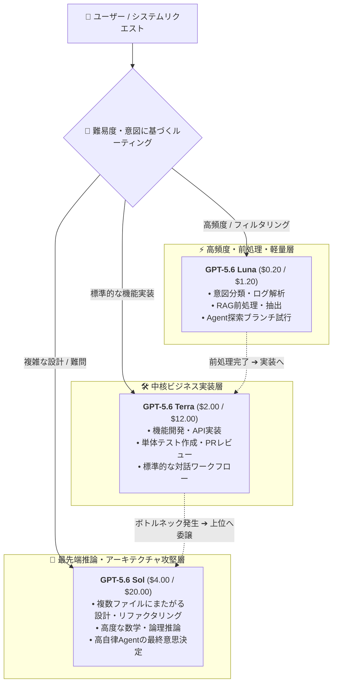

2026年8月22日、OpenAIはフラッグシップモデルである **GPT-5.6 Sol**（および短縮エイリアス `gpt-5.6`）の公式な期間限定値下げを発表しました。今回の価格改定は少なくとも3か月間（2026年8月22日〜11月21日）適用され、API利用および関連するクレジット消費が対象となります。

7月下旬にエントリーおよびミドルレンジの GPT-5.6 Luna（80%オフ）と GPT-5.6 Terra（20%オフ）が突如値下げされたのに続き、今回は最高峰のフラッグシップモデルに直接メスが入ることとなりました。

## 価格改定の詳細

OpenAIの最新公式料金表に基づき、`gpt-5.6-sol` および `gpt-5.6` のAPI利用料は以下のように改定されました：

| トークン種別 | 従来のAPI価格（1Mあたり） | 新しいAPI価格（1Mあたり） | 変動率 |
| :--- | :--- | :--- | ---: |
| **標準入力（Input）** | $5.00 | **$4.00** | **-20.0%** |
| **標準出力（Output）** | $30.00 | **$20.00** | **-33.3%** |
| **キャッシュ書き込み（Cache Write）** | $6.25 | **$5.00** | **-20.0%** |
| **キャッシュヒット（Cached Input）** | $0.50 | **$0.40** | **-20.0%** |

注記：

- 本値下げは最低3か月間保証されており、OpenAIはインフラ負荷や利用状況を評価した上で恒久化を検討する予定です。
- 値下げはAPI呼び出しだけでなく、ChatGPT Work / Codex のクレジット枠にも適用されます。
- Prompt Caching は引き続き90%オフ（入力の10%）を維持し、Cache Writeは入力価格の1.25倍で計算されます。

これにより、GPT-5.6ファミリー全体の価格体系が完全に再構築されました：

| モデル層 | 主な位置づけ | 新入力価格 ($/1M) | 新出力価格 ($/1M) |
| :--- | :--- | :--- | :--- |
| **GPT-5.6 Luna** | 超高コスパ / 前処理 / 日常的なAgent | $0.20 | $1.20 |
| **GPT-5.6 Terra** | バランス型 / 機能開発 / 汎用タスク | $2.00 | $12.00 |
| **GPT-5.6 Sol** | 最先端フラッグシップ / システム設計 / 高度な推論 | **$4.00** | **$20.00** |

## 徹底解説：なぜOpenAIはSolの値下げに踏み切ったのか？

GPT-5.6のリリース当初、Solは $5.00 / $30.00 という強気な価格設定だったため、開発者コミュニティからは費用対効果を慎重に見極める声が多く上がっていました。なぜOpenAIはフラッグシップの価格を早期に引き下げたのでしょうか？

### 1. 出力価格の33.3%削減：Agentと長時間推論の最大のボトルネックを解消

単純なチャット対話では入力トークンが中心ですが、**自律型AI Agent、複数ファイルにまたがるコード生成、Extended Reasoning（拡張思考チェーン）** が普及した現在、出力トークンの生成量は飛躍的に増大しています。

大規模なリファクタリングや高度なデバッグでは、思考ログやコード本文を含めて数万〜数十万トークンの出力が発生します。従来の $30/1M という出力価格は大きなコスト障壁でした。出力を **$20/1M**（-33.3%）へ引き下げたことで、Agentパイプラインの総合コストは25%〜30%以上削減されます。

### 2. オープンソース勢および競合に対する戦略的防衛

ここ数か月、オープンソースモデル（DeepSeekやQwenなど）はコーディングや数学的推論分野で急速に進化し、極めて低い推論コストを武器にシェアを拡大してきました。

最上位モデルが高価なままであれば、開発者はオープンソースの組み合わせへ移行してしまいます。Solを大幅に値下げすることで、OpenAIは**最高峰の能力帯に強固なコスパの防壁を築き**、重要プロジェクトの流出を食い止める狙いがあります。

### 3. 「3か月限定」に込められた戦術

今回の改定を期間限定とした背景には2つの意図があります：
- **インフラの負荷テスト**：値下げによるリクエスト急増を受け止め、推論クラスタのスケーラビリティを実戦検証する。
- **企業予算の囲い込み**：下半期の技術選定や予算策定のタイミングに合わせ、基幹ワークロードの移行を決定づける。

## 実践ガイド：GPT-5.6ファミリーによる多層ルーティング設計

Solが大幅に使いやすくなったことで、GPT-5.6ファミリーによる多段ルーティングが極めて実用的になりました：

**1Mコンテキストウィンドウ** および **Prompt Caching** と組み合わせることで、タスクあたりの総合コスト（Cost-per-Task）を劇的に抑制できます。

## MuiRouterで今すぐ利用可能

MuiRouterでは、OpenAIの最新料金体系にリアルタイムで対応完了しています：

- `gpt-5.6-sol` および `gpt-5.6` へのリクエストは、自動的に新価格 **$4.00 (入力) / $20.00 (出力)** で計算されます；
- Prompt Caching の割引も自動適用されます；
- アプリケーション側のコードや設定を変更する必要はありません。

ぜひ [Playground](/playground) で、新価格となった GPT-5.6 Sol の卓越したパフォーマンスをご体験ください！
