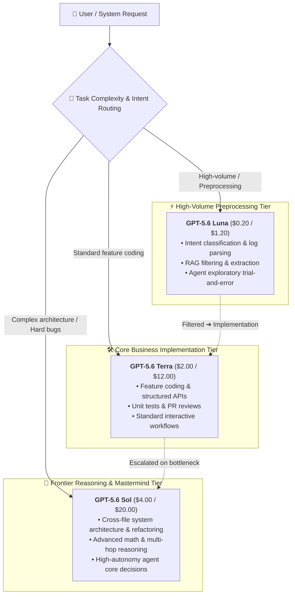

On August 22, 2026, OpenAI officially announced a limited-time price reduction for its flagship model, **GPT-5.6 Sol** (and its short alias `gpt-5.6`). This price cut will last for at least 3 months (from August 22, 2026 through November 21, 2026), covering API usage and associated credit spending.

Following OpenAI's sudden price reduction on the mid-to-entry tiers GPT-5.6 Luna (-80%) and GPT-5.6 Terra (-20%) in late July, this latest move drops another bombshell across the AI pricing landscape—this time targeting the pinnacle flagship model.

## Pricing Details Overview

According to OpenAI's latest official rate card, standard API pricing for `gpt-5.6-sol` and `gpt-5.6` has been adjusted as follows:

| Token Type | Original API Price (per 1M tokens) | New API Price (per 1M tokens) | Change |
| :--- | :--- | :--- | ---: |
| **Standard Input** | $5.00 | **$4.00** | **-20.0%** |
| **Standard Output** | $30.00 | **$20.00** | **-33.3%** |
| **Cache Write** | $6.25 | **$5.00** | **-20.0%** |
| **Cached Input (Read)** | $0.50 | **$0.40** | **-20.0%** |

Notes:

- This limited-time price cut is scheduled for at least 3 months; OpenAI will evaluate infrastructure loads and community response before determining longer-term pricing.
- The discount applies across standard API usage as well as ChatGPT Work / Codex credit metering.
- Prompt Caching continues to offer a 90% discount (10% of input rate), with Cache Writes billed at 1.25× standard input.

With this update, the complete pricing hierarchy across the GPT-5.6 family has been fully reshaped:

| Model Tier | Core Positioning | New Input Rate ($/1M) | New Output Rate ($/1M) |
| :--- | :--- | :--- | :--- |
| **GPT-5.6 Luna** | High Cost-Efficiency / Preprocessing / Daily Agents | $0.20 | $1.20 |
| **GPT-5.6 Terra** | Balanced Workhorse / Feature Coding / General Tasks | $2.00 | $12.00 |
| **GPT-5.6 Sol** | Frontier Flagship / System Architecture / Deep Reasoning | **$4.00** | **$20.00** |

## Deep Breakdown: Why Is OpenAI Slashing Sol Pricing?

When GPT-5.6 originally launched, Sol was priced at a steep $5.00 / $30.00, leading many developers to hesitate over its cost-performance ratio. Why did OpenAI break from its historical precedent of keeping flagship pricing firm so soon?

### 1. Slashing Output by 33.3%: Tackling the Core Pain Point of Long Reasoning & Agents

In traditional single-turn chat workflows, input tokens often dominate. However, with **autonomous AI Agents, multi-file code generation, and Extended Reasoning (reasoning effort)** becoming standard developer practices, output token volume has grown exponentially.

A single complex refactoring run or deep debugging loop can easily generate tens or hundreds of thousands of output tokens in reasoning chains and full-file rewrites. The previous $30/1M output rate represented a substantial cost hurdle. Slashing output directly to **$20/1M** (-33.3%) reduces the composite bill for reasoning-heavy and multi-step agentic workflows by 25% to over 30%.

### 2. Strategic Counterpunch against Open-Source & Market Competition

Over recent months, open-source models (led by DeepSeek, Qwen, and others) have made remarkable strides in coding and mathematical reasoning, eroding commercial workflow share with minimal inference costs. Meanwhile, closed-source competitors have continued to mount pressure.

If frontier models remain behind high price barriers, developers are pushed to compromise by cobbling together open-source alternatives for intensive tasks. Slashing Sol's pricing allows OpenAI to **erect a formidable price-to-performance moat at the very top capability tier**, retaining high-value developer mindshare and sticky production pipelines.

### 3. Strategic Intent Behind the "3-Month Limited Window"

Framing this reduction as a "3-month promotional window" reflects a calculated strategy:
- **Infrastructure Stress-Testing**: Lowering the barrier will trigger a surge in Sol invocations, giving OpenAI a controlled window to test cluster throughput and auto-scaling limits.
- **Locking Enterprise Budget Cycles**: Aligning with late Q3/Q4 planning cycles incentivizes teams to migrate critical workloads and build long-term dependencies. If inference efficiency gains hold over this period, these rates are highly likely to become permanent.

## Best Practices: Multi-Tier Model Routing with the GPT-5.6 Family

With Sol becoming significantly more accessible, the three tiers now form an exceptionally cohesive routing topology:

By pairing this routing architecture with **native 1M context** and **Prompt Caching**, teams can drive overall Cost-per-Task down to unprecedented levels.

## Available on MuiRouter Now

MuiRouter has synchronized with OpenAI's latest rate card in real time:

- Requests for `gpt-5.6-sol` and `gpt-5.6` are now billed at the new **$4.00 (input) / $20.00 (output)** rate;
- Prompt Caching discounts and fast-lane routing apply automatically;
- No configuration or code changes are required—simply dispatch your queries to enjoy the updated pricing.

Head over to the [Playground](/playground) and experience the enhanced value of GPT-5.6 Sol today!
