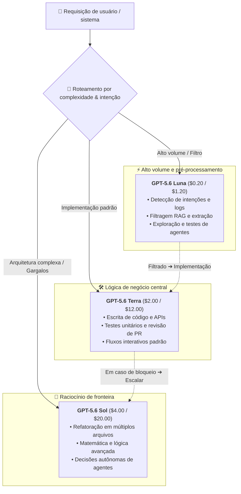

Em 22 de agosto de 2026, a OpenAI anunciou oficialmente um corte promocional de preços para o seu modelo topo de linha, **GPT-5.6 Sol** (e o seu alias curto `gpt-5.6`). Esta redução vigorará por pelo menos 3 meses (de 22 de agosto a 21 de novembro de 2026), cobrindo chamadas de API e créditos associados.

Após a redução surpresa no final de julho nos modelos de entrada e intermediário GPT-5.6 Luna (-80%) e GPT-5.6 Terra (-20%), este novo movimento atinge diretamente o modelo mais avançado da família.

## Visão geral dos ajustes de preço

De acordo com a tabela oficial da OpenAI, as tarifas de API para `gpt-5.6-sol` e `gpt-5.6` foram atualizadas:

| Tipo de Token | Preço de API anterior (por 1M) | Novo preço de API (por 1M) | Variação |
| :--- | :--- | :--- | ---: |
| **Entrada padrão (Input)** | $5.00 | **$4.00** | **-20.0%** |
| **Saída padrão (Output)** | $30.00 | **$20.00** | **-33.3%** |
| **Escrita em cache (Cache Write)** | $6.25 | **$5.00** | **-20.0%** |
| **Entrada em cache (Cached Input)** | $0.50 | **$0.40** | **-20.0%** |

Notas:

- Este desconto promocional tem garantia de pelo menos 3 meses; a OpenAI avaliará a carga de infraestrutura antes de definir a precificação definitiva.
- A redução aplica-se automaticamente à API e às cotas do ChatGPT Work / Codex.
- O Prompt Caching mantém o desconto de 90% (10% do valor de entrada), e a escrita em cache é faturada a 1.25× o valor de entrada padrão.

A matriz de preços da família GPT-5.6 foi assim totalmente reformulada:

| Nível de Modelo | Posicionamento Principal | Nova Entrada ($/1M) | Nova Saída ($/1M) |
| :--- | :--- | :--- | :--- |
| **GPT-5.6 Luna** | Custo-benefício extremo / Pré-processamento / Agentes diários | $0.20 | $1.20 |
| **GPT-5.6 Terra** | Modelo equilibrado / Desenvolvimento de código / Tarefas gerais | $2.00 | $12.00 |
| **GPT-5.6 Sol** | Flagship de fronteira / Arquitetura complexa / Raciocínio profundo | **$4.00** | **$20.00** |

## Análise detalhada: Por que a OpenAI baixou o preço do Sol?

No lançamento original do GPT-5.6, o Sol manteve-se num patamar alto de $5.00 / $30.00, gerando hesitação na comunidade sobre o custo-benefício. Por que a OpenAI quebrou tão rapidamente a tradição de manter preços elevados nos seus modelos principais?

### 1. Corte de 33.3% na saída: Resolvendo o gargalo de agentes e raciocínio

Em conversas simples, os tokens de entrada predominam. No entanto, com a ascensão dos **Agentes de IA autônomos, geração de código em múltiplos arquivos e raciocínio estendido (Extended Reasoning)**, o volume de tokens de saída cresceu exponencialmente.

Uma única sessão de refatoração ou depuração profunda gera facilmente dezenas de milhares de tokens de saída. O valor anterior de $30/1M representava uma barreira orçamentária expressiva. Reduzir a saída diretamente para **$20/1M** (-33.3%) alivia o custo de fluxos intensivos de agentes em 25% a 30% ou mais.

### 2. Contra-ataque estratégico contra modelos open-source e concorrência

Nos últimos meses, modelos abertos (como DeepSeek, Qwen e outros) evoluíram de forma impressionante em programação e matemática, ganhando espaço com custos de inferência mínimos.

Se os modelos topo de linha permanecerem inacessíveis, os desenvolvedores tenderão a migrar para alternativas abertas. Ao tornar o Sol mais acessível, a OpenAI **ergue uma barreira competitiva intransponível no patamar mais alto de inteligência**, retendo fluxos de trabalho corporativos cruciais.

### 3. A estratégia por trás da janela de 3 meses

Apresentar o corte como promocional atende a dois propósitos:
- **Teste de estresse de infraestrutura**: A redução provocará um salto de requisições ao Sol, testando os limites de escala dos clusters de inferência.
- **Fechamento de orçamentos corporativos**: Alinhando-se aos ciclos de planejamento do segundo semestre, estimula equipes a migrarem permanentemente suas aplicações críticas.

## Guia prático: Roteamento multinível com a família GPT-5.6

Com o Sol consideravelmente mais acessível, a família GPT-5.6 estabelece uma arquitetura de roteamento exemplar:

Combinando esse roteamento com a **janela de contexto nativa de 1M** e o **Prompt Caching**, o custo total por tarefa (Cost-per-Task) pode ser reduzido a patamares inéditos.

## Disponível agora no MuiRouter

O MuiRouter sincronizou suas tabelas em tempo real com os novos preços da OpenAI:

- Chamadas para `gpt-5.6-sol` e `gpt-5.6` são cobradas pelo novo valor de **$4.00 (entrada) / $20.00 (saída)**;
- Os descontos de Prompt Caching são aplicados automaticamente;
- Nenhuma alteração de código ou configuração é necessária.

Acesse o [Playground](/playground) e experimente hoje mesmo o poder do GPT-5.6 Sol por um custo muito menor!
