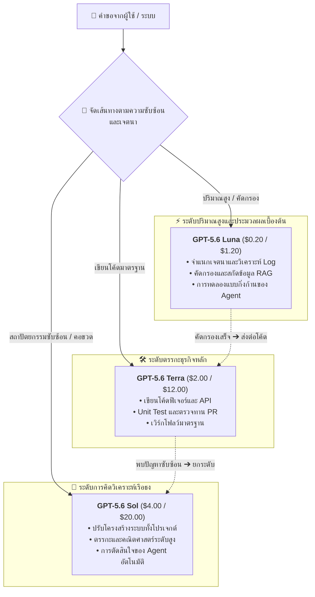

เมื่อวันที่ 22 สิงหาคม 2026 OpenAI ได้ประกาศลดราคาอย่างเป็นทางการสำหรับโมเดลเรือธงตัวท็อปอย่าง **GPT-5.6 Sol** (รวมถึงชื่อย่อ alias `gpt-5.6`) โดยการปรับลดราคาครั้งนี้จะมีผลเป็นเวลาอย่างน้อย 3 เดือน (ตั้งแต่วันที่ 22 สิงหาคม ถึง 21 พฤศจิกายน 2026) ครอบคลุมการเรียกใช้ API และการหักเครดิตที่เกี่ยวข้อง

นี่คือการเคลื่อนไหวสำคัญอีกครั้งหลังจากที่ OpenAI เพิ่งลดราคาโมเดลระดับเริ่มต้นและระดับกลางอย่าง GPT-5.6 Luna (-80%) และ GPT-5.6 Terra (-20%) ไปเมื่อปลายเดือนกรกฎาคม โดยในครั้งนี้ส่งผลต่อโมเดลระดับเรือธงสูงสุดโดยตรง

## รายละเอียดการปรับลดราคา

ตามตารางราคาล่าสุดของ OpenAI อัตราค่าบริการ API สำหรับ `gpt-5.6-sol` และ `gpt-5.6` มีการเปลี่ยนแปลงดังนี้:

| ประเภท Token | ราคา API เดิม (ต่อ 1M tokens) | ราคา API ใหม่ (ต่อ 1M tokens) | ส่วนลด |
| :--- | :--- | :--- | ---: |
| **Input มาตรฐาน** | $5.00 | **$4.00** | **-20.0%** |
| **Output มาตรฐาน** | $30.00 | **$20.00** | **-33.3%** |
| **Cache Write** | $6.25 | **$5.00** | **-20.0%** |
| **Cached Input (Read)** | $0.50 | **$0.40** | **-20.0%** |

หมายเหตุ:

- การลดราคานี้รับประกันเป็นเวลาอย่างน้อย 3 เดือน โดย OpenAI จะประเมินโหลดของโครงสร้างพื้นฐานก่อนพิจารณาปรับเป็นราคาถาวรต่อไป
- ส่วนลดมีผลกับทั้งการเรียกใช้ API และโควตาใน ChatGPT Work / Codex
- Prompt Caching ยังคงได้รับส่วนลด 90% (คิด 10% ของราคา Input) และ Cache Write คิด 1.25 เท่าของ Input

ส่งผลให้โครงสร้างราคาของโมเดลตระกูล GPT-5.6 ถูกจัดระเบียบใหม่ทั้งหมด:

| ระดับโมเดล | จุดเด่นหลัก | ราคา Input ใหม่ ($/1M) | ราคา Output ใหม่ ($/1M) |
| :--- | :--- | :--- | :--- |
| **GPT-5.6 Luna** | คุ้มค่าสูงสุด / ประมวลผลเบื้องต้น / Agent ประจำวัน | $0.20 | $1.20 |
| **GPT-5.6 Terra** | สมดุลรอบด้าน / เขียนโค้ดฟีเจอร์ / งานทั่วไป | $2.00 | $12.00 |
| **GPT-5.6 Sol** | เรือธงแถวหน้า / สถาปัตยกรรมระบบ / การคิดวิเคราะห์ขั้นสูง | **$4.00** | **$20.00** |

## บทวิเคราะห์เชิงลึก: ทำไม OpenAI จึงยอมลดราคา Sol?

เมื่อตอนเปิดตัว GPT-5.6 โมเดล Sol ตั้งราคาไว้ค่อนข้างสูงที่ $5.00 / $30.00 ทำให้ชุมชนนักพัฒนาลังเลในเรื่องความคุ้มค่า ทำไม OpenAI จึงยอมฉีกแนวปฏิบัติเดิมที่มักตรึงราคาโมเดลเรือธงไว้สูงเป็นเวลานาน?

### 1. ลดราคา Output ลง 33.3%: ปลดล็อกคอขวดของ AI Agent และการคิดวิเคราะห์

ในการสนทนาทั่วไป Token ฝั่ง Input มักมากกว่า Output แต่ด้วยการเติบโตอย่างรวดเร็วของ **Autonomous AI Agent, การสร้างโค้ดข้ามไฟล์ และ Extended Reasoning (ห่วงโซ่การคิดแบบยาว)** ปริมาณ Token ฝั่ง Output จึงเพิ่มขึ้นมหาศาล

งานปรับแก้โค้ดหรือการดีบักเชิงลึกในระบบใหญ่สามารถสร้าง Output ได้หลายหมื่น Token ราคาเดิมที่ $30/1M จึงเป็นอุปสรรคสำคัญ การลดราคา Output ลงเหลือ **$20/1M** (-33.3%) ช่วยลดค่าใช้จ่ายโดยรวมของระบบ Agent ลงได้ถึง 25% - 30% ทันที

### 2. ตอบโต้โมเดล Open-Source และการแข่งขันในตลาด

ในช่วงที่ผ่านมา โมเดล Open-Source (นำโดย DeepSeek, Qwen และอื่นๆ) พัฒนาความสามารถในการเขียนโค้ดและตรรกศาสตร์อย่างก้าวกระโดด พร้อมต้นทุนการประมวลผลที่ต่ำมาก

หากโมเดลตัวท็อปยังคงมีราคาสูง นักพัฒนาจะหันไปใช้ทางเลือกแบบเปิดแทน การลดราคา Sol ทำให้ OpenAI **สร้างกำแพงความคุ้มค่าที่แข็งแกร่งในระดับบนสุด** เพื่อดึงดูดนักพัฒนาและระบบงานระดับองค์กรไว้กับตนเอง

### 3. กลยุทธ์เบื้องหลังกรอบเวลา 3 เดือน

การระบุว่าเป็นโปรโมชัน 3 เดือนสะท้อน 2 เป้าหมายหลัก:
- **ทดสอบขีดความสามารถของระบบ**: ราคาที่ถูกลงจะกระตุ้นยอดเรียกใช้ Sol อย่างมหาศาล เป็นโอกาสให้ทดสอบการขยายขนาดของคลัสเตอร์เซิร์ฟเวอร์
- **ล็อกงบประมาณองค์กร**: ตรงกับช่วงวางแผนงบประมาณครึ่งปีหลัง จึงเป็นแรงจูงใจให้ทีมต่างๆ ย้ายระบบงานสำคัญมาอย่างถาวร

## แนวทางปฏิบัติ: การทำ Multi-Tier Routing ด้วย GPT-5.6

เมื่อ Sol เข้าถึงได้ง่ายขึ้น ตระกูล GPT-5.6 จึงกลายเป็นสถาปัตยกรรม Routing ที่สมบูรณ์แบบ:

เมื่อใช้ร่วมกับ **Context Window ขนาด 1M** และ **Prompt Caching** จะช่วยลดต้นทุนรวมต่องาน (Cost-per-Task) ลงสู่จุดที่คุ้มค่าอย่างยิ่ง

## พร้อมใช้งานแล้วบน MuiRouter

MuiRouter ได้ปรับปรุงระบบราคาตามอัตราใหม่ของ OpenAI เรียบร้อยแล้ว:

- การเรียกใช้ `gpt-5.6-sol` และ `gpt-5.6` จะคิดค่าบริการตามอัตราใหม่ที่ **$4.00 (Input) / $20.00 (Output)** ทันที;
- ส่วนลด Prompt Caching ทำงานโดยอัตโนมัติ;
- ไม่จำเป็นต้องแก้ไขโค้ดหรือการตั้งค่าใดๆ เพิ่มเติม

เชิญทดลองประสิทธิภาพระดับเรือธงของ GPT-5.6 Sol ในราคาใหม่ได้ที่ [Playground](/playground) วันนี้!
