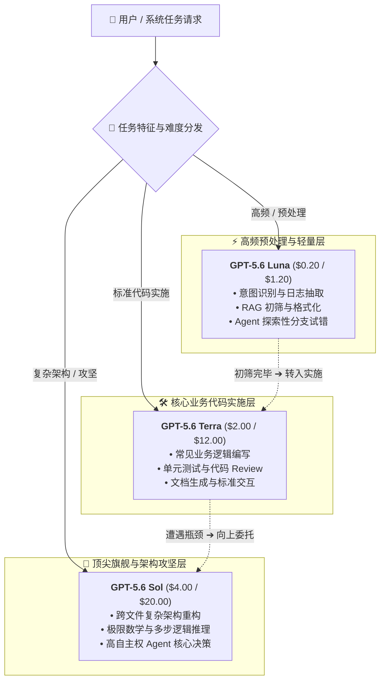

2026 年 8 月 22 日，OpenAI 官方正式宣布对旗下旗舰模型 **GPT-5.6 Sol**（以及短名 alias `gpt-5.6`）开启官方限时降价。本次调价为期至少 3 个月（自 2026 年 8 月 22 日起至 2026 年 11 月 21 日），涵盖 API 调用与相关信用额度。

这是继 7 月底 OpenAI 闪电下调 GPT-5.6 Luna（直降 80%）与 GPT-5.6 Terra（直降 20%）之后，时隔三周再次向大模型价格体系投掷的重磅炸弹——这一次，直接动到了金字塔尖的王牌旗舰。

## 调价细节一览

根据 OpenAI 官方发布的最新定价，`gpt-5.6-sol` 及短名 `gpt-5.6` 的标准 API 费率已做如下调整：

| Token 类型 | 原 API 定价（每 1M tokens） | 新 API 定价（每 1M tokens） | 变动幅度 |
| :--- | :--- | :--- | ---: |
| **标准输入（Input）** | $5.00 | **$4.00** | **-20.0%** |
| **标准输出（Output）** | $30.00 | **$20.00** | **-33.3%** |
| **缓存写入（Cache Write）** | $6.25 | **$5.00** | **-20.0%** |
| **缓存命中（Cached Input）** | $0.50 | **$0.40** | **-20.0%** |

注：

- 本次限时降价至少持续 3 个月，官方后续将根据市场反馈与基础设施负载决定后续定价策略；
- 降价同时适用于 API 结算以及 ChatGPT Work / Codex 对应的计费额度；
- Prompt Caching 仍维持 1 折（10% input）超低读取折扣，Cache Write 为 1.25× 输入价。

至此，GPT-5.6 家族三档模型的价格梯度已全部完成重塑：

| 模型档位 | 核心定位 | 新输入定价 ($/1M) | 新输出定价 ($/1M) |
| :--- | :--- | :--- | :--- |
| **GPT-5.6 Luna** | 高性价比 / 预处理 / 日常 Agent | $0.20 | $1.20 |
| **GPT-5.6 Terra** | 均衡型 / 业务编码 / 通用任务 | $2.00 | $12.00 |
| **GPT-5.6 Sol** | 顶尖旗舰 / 复杂架构 / 极限推理 | **$4.00** | **$20.00** |

## 深度剖析：为什么 OpenAI 要降 Sol？

在 GPT-5.6 发布之初，Sol 维持了 $5.00 / $30.00 的高定价，社区普遍对其性价比持观望态度。为何短短一个月内，OpenAI 会打破以往旗舰模型价格坚挺的惯例？

### 1. 输出端直降 33.3%：直击深度推理与 Agent 的最大痛点

在传统的单轮问答中，输入往往大于输出；但在当前 **AI Agent、自主代码编写与 Extended Reasoning（扩展思考链）** 成为主流的背景下，模型的 Output Token 产生量呈几何级数上升。

一次复杂的全工程重构或深度 Debug，模型可能会输出数万甚至数十万 Token 的思考过程与完整代码。过去高达 $30/1M 的输出价格是横亘在诸多企业和开发者面前的主要成本门槛。这次将 Output 直接砍到 **$20/1M**，降幅达到 **33.3%**，对于依赖长输出与多轮自我纠错的 Agent 应用而言，综合账单将直接缩水 25%~30% 以上。

### 2. 迎击开源模型与同业竞争的防守反击

近几个月来，开源大模型（以 DeepSeek、Qwen 等为代表）在代码生成与数学推理等前沿领域展现了惊人的追赶速度，以极低的推理成本持续蚕食企业与独立开发者的工作流。与此同时，商业闭源阵营中的竞争也日趋白热化。

如果顶级旗舰模型始终维持高昂的价格壁垒，开发者在面对高频、长链任务时势必会退而求其次选择开源方案或廉价平替。OpenAI 在此时对 Sol 主动降价，正是为了**在最高端的能力维度上构筑不可逾越的性价比护城河**，牢牢锁定核心开发者的心智与工作流。

### 3. “限时 3 个月”的策略考量

将本次降价定为“限时至少 3 个月”，体现了 OpenAI 的双重考量：
- **算力压力测试**：调价必然引发全球开发者对 Sol 的调用洪峰，限时机制为底层推理集群的弹性扩容和吞吐承载提供了缓冲空间；
- **采购周期锁定**：恰逢下半年企业技术选型与预算规划的关键窗口，极具诱惑力的高端降价能有效拉动 API 迁移与长期绑定。若 3 个月后推理成本进一步优化，该价格极大概率将固化为常态基准。

## 实战指南：GPT-5.6 家族多级路由的最佳架构

随着 Sol 价格的大幅下探，GPT-5.6 三兄弟构成了目前业内最为完备的多级模型梯队：

结合 **1M 上下文** 与 **Prompt Caching**，开发者可以在保持极致性能的同时，将单位任务综合成本（Cost-per-Task）降到不可思议的新低。

## MuiRouter 现已全量跟进

MuiRouter 第一时间同步跟进了 OpenAI 官方的最新费率：

- `gpt-5.6-sol` 与 `gpt-5.6` 的调用计费现已实时切换为最新的 **$4.00 (输入) / $20.00 (输出)** 费率；
- 配合既有的 Prompt Caching 与极速通道，全链路享受降价红利；
- 开发者无需修改现有代码或配置，只要正常发起请求即可自动按新费率结算。

欢迎大家前往 [Playground](/playground) 体验降价后的 GPT-5.6 Sol 旗舰能力！
