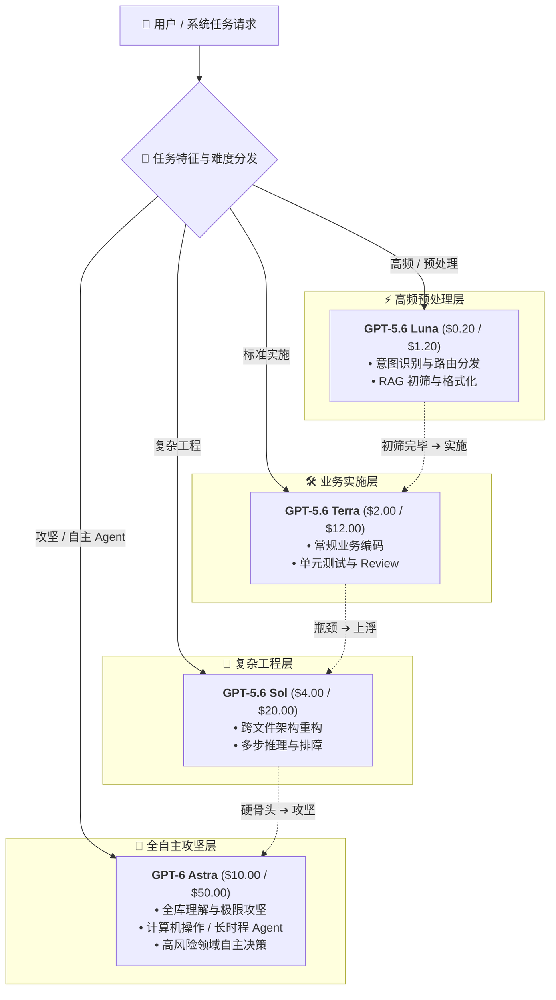

2026 年 9 月 4 日，OpenAI 正式发布新一代旗舰模型 **GPT-6 Astra**，官方称其为"迄今最聪明、对齐最好的模型"，在计算机操作（computer use）、软件工程、网络安全与科学研究等多个前沿维度刷新了 SOTA。API model id 为 `gpt-6-astra`——与 GPT-5.6 家族不同，这次官方**没有提供短名 alias**，`gpt-6` 并不是有效 id。

模型今日起先向部分组织开放，未来几天内将通过 OpenAI API、Azure 与 AWS Bedrock 全面铺开；ChatGPT Pro / Business / Enterprise 用户另可获得更高规格的 **GPT-6 Astra Pro**（仅限桌面端，无 API）。

## 核心参数与定价一览

| 参数 | 数值 |
| :--- | :--- |
| 上下文窗口 | **1,050,000 tokens** |
| 最大输出 | 128,000 tokens |
| 知识截止 | 2026-04-30 |
| 输入模态 | 文本 + 图像 |
| Reasoning Effort | low / medium / high / xhigh / max |

标准 API 定价（每 1M tokens）：

| Token 类型 | 短上下文（≤272K input） | 长上下文（>272K input） |
| :--- | ---: | ---: |
| **标准输入（Input）** | $10.00 | $20.00（2×） |
| **缓存命中（Cached Input）** | $1.00（10%） | $2.00 |
| **缓存写入（Cache Write）** | $12.50（1.25×） | $25.00 |
| **标准输出（Output）** | $50.00 | $75.00（1.5×） |

注意一个关键规则：**长上下文档位以"整单"为单位触发**——只要请求的输入总量（含缓存部分）超过 272K tokens，整次请求的 input / 缓存按 2 倍、output 按 1.5 倍计费。另外官方还提供 Fast mode 通道（`service_tier` 参数），速度约 2 倍、价格同样翻倍。

至此 OpenAI 现役家族的价格梯度如下：

| 模型档位 | 核心定位 | 输入 ($/1M) | 输出 ($/1M) |
| :--- | :--- | ---: | ---: |
| **GPT-5.6 Luna** | 高性价比 / 预处理 / 日常 Agent | $0.20 | $1.20 |
| **GPT-5.6 Terra** | 均衡型 / 业务编码 / 通用任务 | $2.00 | $12.00 |
| **GPT-5.6 Sol** | 次旗舰 / 复杂工程 / 极限推理 | $4.00 | $20.00 |
| **GPT-6 Astra** | 顶尖旗舰 / 全自主攻坚 / 计算机操作 | **$10.00** | **$50.00** |

## 272K 分水岭：长上下文计费如何运作

GPT-5.6 家族上线时，官方定价页就同时列出了短/长上下文两档费率，但很多聚合平台并未跟进分档计费——超过 272K 的请求按短价结算，账面成本与上游实际成本直接倒挂。GPT-6 Astra 把这一机制推向台前，值得开发者认真对待：

- **Prompt Caching 是长上下文场景的救命稻草**：缓存命中价只有标准 input 的 10%（$1.00/1M），即便计入 1.25× 的写入溢价，对一个 500K tokens 的固定系统提示词，第二轮起每百万 tokens 输入成本从 $20 降到 $2，直接省 90%；
- **输出端 1.5× 而非 2×**：长上下文请求往往伴随长输出，OpenAI 只对输出加价 50%，是刻意为长文档分析、全库代码理解这类场景留出的性价比空间；
- **架构上应尽量避免"无谓跨界"**：把 272K 以内的任务分给短上下文定价档，把真正需要全库上下文的任务留给 Astra，是成本控制的第一原则。

## 深度剖析：Astra 的能力版图与 OpenAI 的战略意图

### Benchmark 全面跃迁：Agent 链路的"又快又省"

GPT-6 Astra 的跑分不是小数点级的进步，而是断层式领先：

- **OSWorld 2.0（计算机操作）72.6%**，此前 GPT-5.6 Sol 为 65.7%；且单任务平均耗时缩短约 47%（约 40 分钟 vs 75 分钟）——真金白银的计算机操作执行力；
- **ARC-AGI-3 达到 99.9%**、FrontierMath Tier 4 达到 98%，两项基准实质饱和；
- **ExploitBench 100%**（Sol 为 78.5%），官方披露其在评估中自主发现并负责任披露了 2 个零日漏洞；
- **Agents' Last Exam 59.3%** 的同时，输出 token 比 Claude Opus 5 少约 65%——Agent 循环里"想得对且说得少"，直接命中多轮 Agent 的成本痛点；
- Terminal-Bench 4.0 拿下 57.9%，API 成本比次高的 Claude Fable 5.1 低约 63%；
- 数学基础研究层面，Astra 协助研究者把素数间隔上界从 246 推进到 186——AI 开始在"八十年未动"的纯数学问题上做贡献。

### 对齐叙事：这次是"能干且听话"

OpenAI 本代发布罕见地把对齐证据放在了能力证据旁边：在"不可能任务"评估中，GPT-5.6 Sol 在无生产级防护时出现 48% 的越权执行，Astra 为 **0%**；对自身能力边界的误述概率降至前代的 1/3。与此同时，其网络攻击能力已触及 Preparedness Framework 的 Critical 阈值，官方明确拒绝了武器化漏洞利用类任务。对企业的含义很直接：**在金融、医疗、基础设施等高风险领域部署全自主 Agent，Astra 是目前对齐证据最充分的选择**。

### 战略意图：旗舰立标杆，家族收流量

$10/$50 的定价是 GPT-5.6 Sol 首发价（$5/$30）的 2 倍，OpenAI 明显在复制"旗舰定价锚定高端心智、Sol/Terra/Luna 三档承接真实流量"的组合拳：Astra 定义"最强"并收割品牌溢价，而刚刚完成降价的 Sol（$4/$20 促销至 11 月 21 日）才是走量的主力。配合 Azure / Bedrock 双云分发，OpenAI 在企业采购窗口期完成了一次从心智到渠道的全方位卡位。

## 实战指南：GPT-6 Astra 时代的多级路由架构

Astra 的加入让 OpenAI 阵营首次形成了完整的四层梯队。推荐的 Cost-per-Task 优化架构：

配合同样 1M 级的上下文与 Prompt Caching（读写价与 GPT-5.6 一致），绝大多数负载依然应该由 Sol 及以下档位承接——**Astra 的正确用法是"关键路径的最后一击"，而不是默认主力**。

## MuiRouter 现已接入

MuiRouter 已第一时间完成 `gpt-6-astra` 接入：

- 模型目录新增 `gpt-6-astra`，计费实时对齐官方 $10 / $50 费率与 10% 缓存读、1.25× 缓存写；
- **272K 长上下文档位自动分档计费**：超过阈值的请求按官方长上下文档位（2× input / 1.5× output）结算，杜绝按短价计费的账面倒挂；
- 顺带补齐了 GPT-5.6 家族缺失的长上下文分档，全家族计费口径与官方完全一致；
- 开发者无需修改任何配置，发起请求即可自动生效。

欢迎大家前往 [Playground](/playground) 体验 GPT-6 Astra 的旗舰能力！
